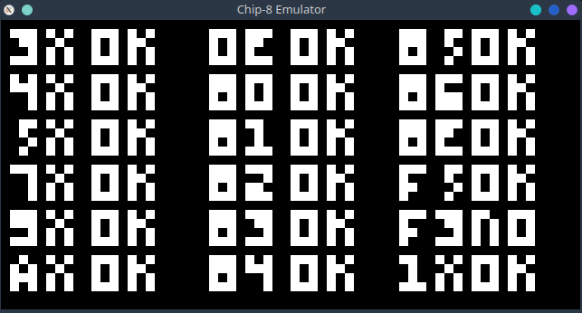

# Chip-8 

Este é um projeto de **interpretador/emulador** para a linguagem de máquina Chip-8, implementado em C++. O Chip-8 foi utilizado em antigos sistemas de microcomputadores como o COSMAC VIP e o Telmac 1800, sendo famoso por sua simplicidade e por ser uma das primeiras linguagens de máquina de 8 bits.

## Funcionalidades

- Executa jogos e programas escritos na linguagem Chip-8.
- Suporte a gráficos simples, sons e entrada de teclado.
- Facilidade para adicionar ROMs Chip-8.

## Como compilar
- ```cmake -B build .```
- ```make```


  


